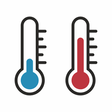
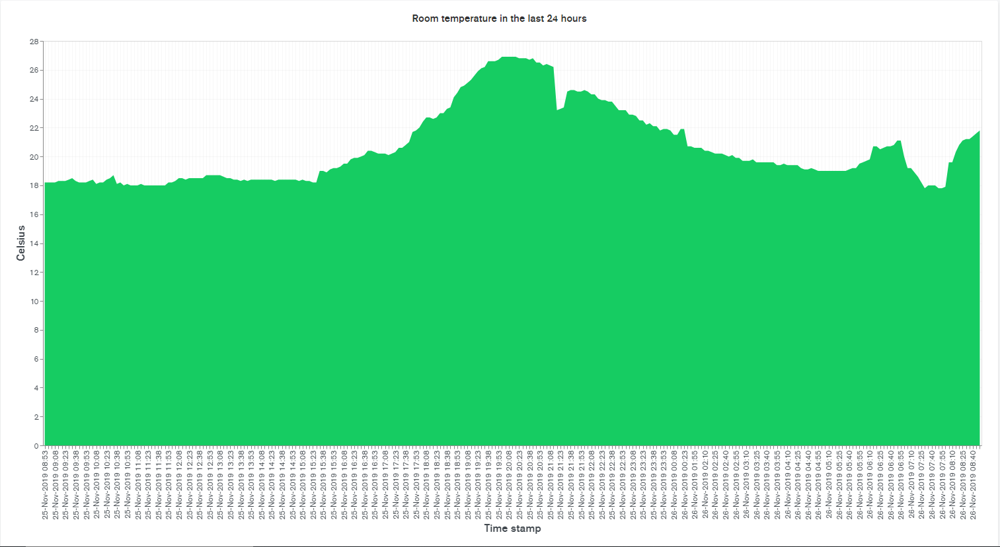
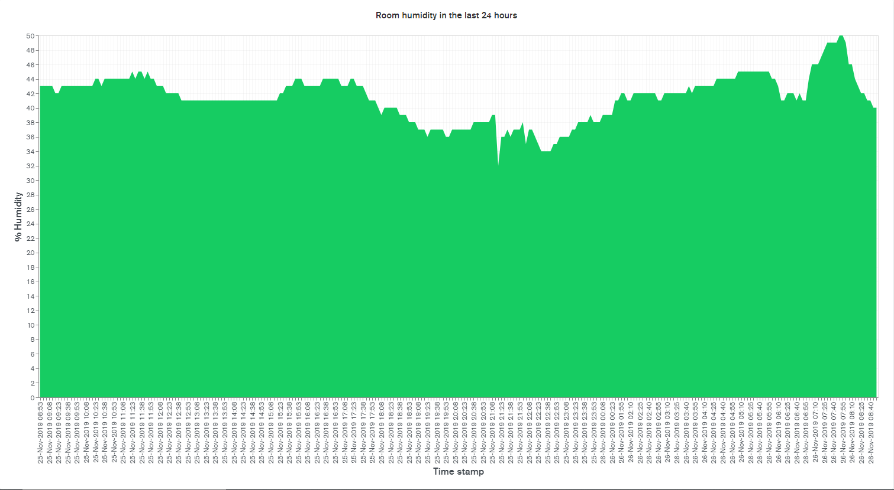
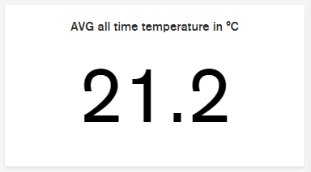
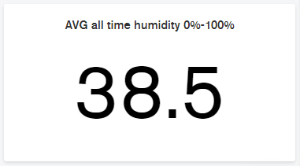

<!--
*** Thanks for checking out this README Template. If you have a suggestion that would
*** make this better, please fork the repo and create a pull request or simply open
*** an issue with the tag "enhancement".
*** Thanks again! Now go create something AMAZING! :D
***
***
***
*** To avoid retyping too much info. Do a search and replace for the following:
*** github_username, repo, twitter_handle, email
-->


<!-- PROJECT SHIELDS -->
<!--
*** I'm using markdown "reference style" links for readability.
*** Reference links are enclosed in brackets [ ] instead of parentheses ( ).
*** See the bottom of this document for the declaration of the reference variables
*** for contributors-url, forks-url, etc. This is an optional, concise syntax you may use.
*** https://www.markdownguide.org/basic-syntax/#reference-style-links
-->
[![Contributors][contributors-shield]][contributors-url]
[![Forks][forks-shield]][forks-url]
[![Stargazers][stars-shield]][stars-url]
[![Issues][issues-shield]][issues-url]
[![MIT License][license-shield]][license-url]


<!-- PROJECT LOGO -->
<br />
<p align="center">
  <a href="https://github.com/BramEsendam/Temperature-monitoring">
    
  </a>

  <h3 align="center">Temperature monitoring</h3>

  <p align="center">
    Measure the temperature in your room!
    <br />
    <br />
    <a href="https://github.com/BramEsendam/Temperature-monitoring/issues">Report Bug</a>
    ·
    <a href="https://github.com/BramEsendam/Temperature-monitoring/issues">Request Feature</a>
  </p>
</p>


<!-- TABLE OF CONTENTS -->
## Table of Contents

* [About the Project](#about-the-project)
  * [Built With](#built-with)
* [Getting Started](#getting-started)
  * [Prerequisites](#prerequisites)
  * [Installation](#installation)
* [Usage](#usage)
* [Contributing](#contributing)
* [License](#license)
* [Acknowledgements](#acknowledgements)


<!-- ABOUT THE PROJECT -->
## About The Project

This is a simple project using C# and a DHT22 sensor to measure temperature and humidity.
The data that we will gather from the sensor will be stored in a MongoDb database.
So you will need a raspberry pi and a DHT22 sensor for this project.


### Built With

* [C#](https://docs.microsoft.com/en-us/dotnet/csharp/)
* [MongoDb](https://www.mongodb.com/)


<!-- GETTING STARTED -->
## Getting Started

To get a local copy up and running follow these simple steps.

### Prerequisites

* .net core 3.1
Follow the steps explained [here](https://dotnet.microsoft.com/download/dotnet-core/3.0).
  
* A MongoDb database  
You can get a free database [here](https://www.mongodb.com/download-center).
  
* DHT22

* Male/Female Jumper Wires

### Installation
 
1. Clone the repo
```sh
git clone https://github.com/BramEsendam/Temperature-monitoring.git
```
2. Publish the project
```sh
dotnet publish -r linux-arm
```  
3. Create a `config` directory in your runtime directory

4. Create a `DatabaseConfig.json` file in the config folder
```json
{
  "ConnectionString": "Your MongoDb conntion string goes here"
}
```
5. Connect your DHT22 sensor to the raspberry pi


<!-- USAGE EXAMPLES -->
## Usage

You can draw graphs with your data if you are hosting your database on [MongoDb Atlas](https://www.mongodb.com/cloud/atlas).  
You can view the documentations [here](https://docs.atlas.mongodb.com/).   

Here is a little preview on what my graphs looks like.





<!-- CONTRIBUTING -->
## Contributing

Contributions are what make the open source community such an amazing place to be learn, inspire, and create. Any contributions you make are **greatly appreciated**.

1. Fork the Project
2. Create your Feature Branch (`git checkout -b feature/AmazingFeature`)
3. Commit your Changes (`git commit -m 'Add some AmazingFeature'`)
4. Push to the Branch (`git push origin feature/AmazingFeature`)
5. Open a Pull Request


<!-- LICENSE -->
## License

Distributed under the MIT License. See `LICENSE` for more information.


<!-- ACKNOWLEDGEMENTS -->
## Acknowledgements

* [Dotnet/iot](https://github.com/dotnet/iot)
* [aspnet/DependencyInjection](https://github.com/aspnet/DependencyInjection)
* [Img Shields](https://shields.io)
* [Readme template](https://github.com/othneildrew/Best-README-Template)


<!-- MARKDOWN LINKS & IMAGES -->
<!-- https://www.markdownguide.org/basic-syntax/#reference-style-links -->
[contributors-shield]: https://img.shields.io/github/contributors/BramEsendam/Temperature-monitoring.svg?style=flat-square
[contributors-url]: https://github.com/BramEsendam/Temperature-monitoring/graphs/contributors
[forks-shield]: https://img.shields.io/github/forks/BramEsendam/Temperature-monitoring.svg?style=flat-square
[forks-url]: https://github.com/BramEsendam/Temperature-monitoring/network/members
[stars-shield]: https://img.shields.io/github/stars/BramEsendam/Temperature-monitoring.svg?style=flat-square
[stars-url]: https://github.com/BramEsendam/Temperature-monitoring/stargazers
[issues-shield]: https://img.shields.io/github/issues/BramEsendam/Temperature-monitoring.svg?style=flat-square
[issues-url]: https://github.com/BramEsendam/Temperature-monitoring/issues
[license-shield]: https://img.shields.io/github/license/BramEsendam/Temperature-monitoring.svg?style=flat-square
[license-url]: https://github.com/BramEsendam/Temperature-monitoring/blob/master/LICENSE.txt
[product-screenshot]: images/screenshot.png
